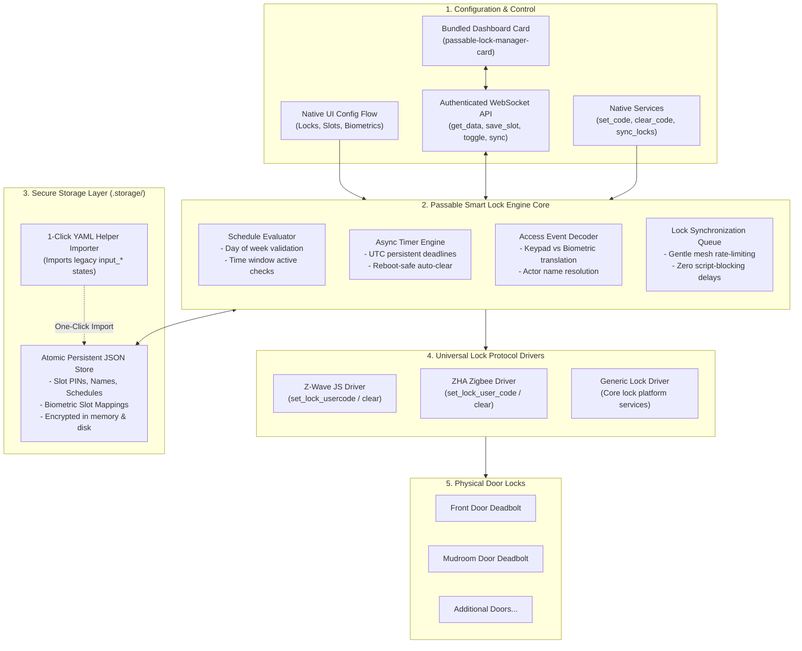

# 🔐 Passable Smart Lock Engine

[](https://github.com/hacs/default)
[](https://github.com/GBear09/passable-smart-lock-engine/releases)
[](LICENSE)

A unified, high-performance, universal smart lock and access control engine for Home Assistant. Combines multi-door synchronization, access scheduling, temporary duration timers, guest mode toggles, biometric family member identification, and a bundled next-generation dashboard card.

Runs natively on Home Assistant Core's asynchronous engine with persistent `.storage` backing, zero plaintext PIN exposure, and 1-click automated migration from legacy YAML helper packages.

---

## ⚙️ Key Features

- **🚪 Universal Multi-Lock Synchronization:** Intelligently programs, clears, and synchronizes user PIN codes across multiple physical doors simultaneously. Features non-blocking asynchronous dispatch with driver adapters for **Z-Wave JS**, **ZHA (Zigbee)**, and generic Home Assistant locks.
- **🛡️ Secure Masked Storage:** Replaces dozens of plaintext `input_text.lock_code_pin_*` state entities with secure Home Assistant `.storage` persistence. PIN codes are never exposed to the state machine or recorder database in cleartext.
- **⏱️ Persistent Temporary Access Timers:** Create temporary access codes with duration timers (1–72 hours). Expiration deadlines are saved as UTC timestamps—timers survive Home Assistant reboots and cleanly clear or disable codes upon expiry.
- **📅 Granular Day & Time Schedules:** Restrict code slots to specific days of the week (Sunday–Saturday) and customizable daily time windows (e.g. 08:00 to 17:00). Schedules are evaluated in-memory with zero template parsing overhead.
- **👤 Keypad & Biometric Actor Resolution:** Automatically translates Yale / Z-Wave alarm notifications (`alarmType 19` for keypad entries, `alarmType 145` for biometric fingerprints) into human names, family member flags, and guest flags without fragile Jinja templates.
- **🎲 1-Click Secure PIN Generator:** Instantly generate random, cryptographically secure 4-to-8 digit PIN codes.
- **📦 Bundled Dashboard Card:** Serves the sleek `passable-lock-manager-card` automatically to your Home Assistant frontend. No manual Lovelace resource registration required.
- **🔄 1-Click YAML Package Migration:** Built-in automated helper importer detects legacy `input_text`, `input_boolean`, `input_number`, and `input_datetime` entities and imports all slots, PINs, and schedules into native storage with zero manual re-entry.
- **🎛️ Dynamic Slot Allocation:** Expand or shrink your managed code slot count (1 to 30) anytime through the UI without editing YAML or restarting Home Assistant.

---

## 📂 System Architecture



---

## 📦 Installation via HACS

1. In Home Assistant, open **HACS** > **Integrations**.
2. Click the three dots in the top-right corner and select **Custom repositories**.
3. Add the repository URL: `https://github.com/GBear09/passable-smart-lock-engine`
4. Select category: **Integration**.
5. Click **Add**, find **Passable Smart Lock Engine**, and click **Download**.
6. Restart Home Assistant.
7. Go to **Settings** > **Devices & Services** > **Add Integration** and search for **Passable Smart Lock Engine**.

---

## ⚙️ Configuration & Options

### Initial Setup (Config Flow)
During initial setup, the integration will prompt you for:
* **Managed Locks:** Select all lock entities (e.g., `lock.front_door`, `lock.mudroom_door`).
* **Number of Managed Slots:** Total code slots to manage (default: `10`, range: `1–30`).
* **Import YAML Helpers:** Check this box to automatically import all active PINs, names, and schedules from your existing `input_*` helpers.

### Settings & Biometric Mapping (Options Flow)
Click **Configure** on the integration card at any time to:
* Add or remove managed locks.
* Adjust total managed slot count on the fly.
* Name biometric fingerprint slots (e.g. Yale Slot 1, 2, 3, 4) for family member notifications.

---

## 🎛️ Dashboard Card

The integration automatically serves `passable-lock-manager-card.js` at `/passable_smart_lock_engine/passable-lock-manager-card.js` and registers the Lovelace resource automatically.

Add the card to any dashboard:

```yaml
type: custom:passable-lock-manager-card
title: Entry Door Locks & Access
subtitle: Smart Lock Command Center
slots: 10
collapse_inactive_slots: true
show_lock_all: true
show_timeline: true
timeline_hours: 24
max_events: 10
locks:
  - entity: lock.front_door
    name: Front Door
    battery: sensor.front_door_battery_level
    jammed: binary_sensor.front_door_lock_jammed
  - entity: lock.mudroom_door
    name: Mudroom Door
    battery: sensor.mudroom_door_battery_level
    jammed: binary_sensor.mudroom_door_lock_jammed
```

---

## 🛠️ Provided Services

| Service | Description | Parameters |
|---|---|---|
| `passable_smart_lock_engine.set_code` | Sets/updates slot PIN, schedule, or timer | `code_slot`, `pin`, `name`, `enabled`, `duration`, `schedule_days`, etc. |
| `passable_smart_lock_engine.clear_code` | Clears code from storage and hardware | `code_slot` |
| `passable_smart_lock_engine.enable_code` | Enables slot code on hardware | `code_slot` |
| `passable_smart_lock_engine.disable_code` | Deactivates slot code on hardware | `code_slot` |
| `passable_smart_lock_engine.sync_locks` | Syncs all active codes across all doors | *None* |
| `passable_smart_lock_engine.generate_random_pin` | Generates secure random PIN | `length` (default: 6) |
| `passable_smart_lock_engine.import_from_yaml_helpers` | Runs automated helper migration | *None* |
| `passable_smart_lock_engine.get_lock_user_info` | Decodes alarmType & alarmLevel into user details | `alarm_type`, `alarm_level` |
| `passable_smart_lock_engine.manage_lock_codes` | Backwards-compatibility wrapper for legacy script | `code_slot`, `action` |

---

## 📄 License

MIT License. Created by GBear09.
